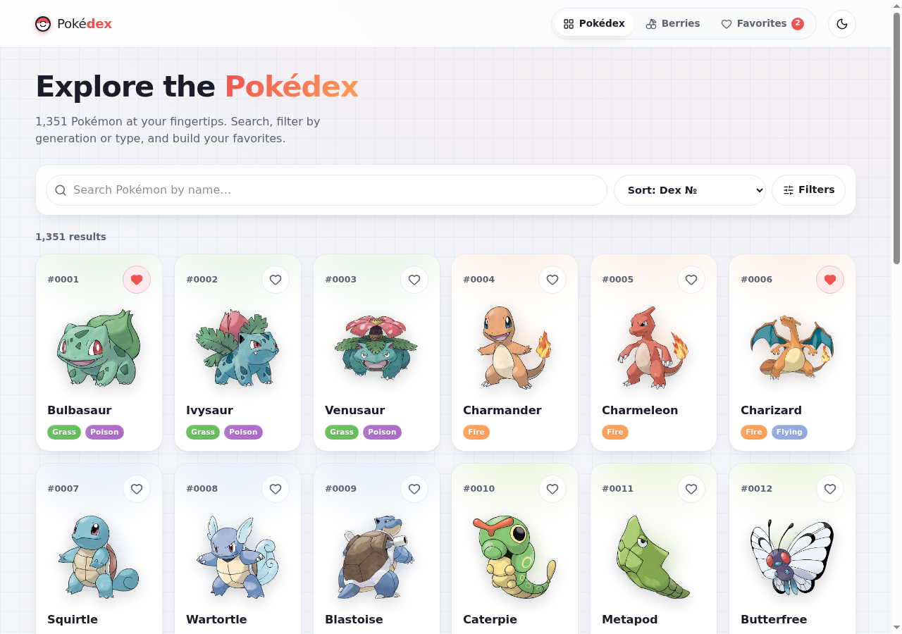
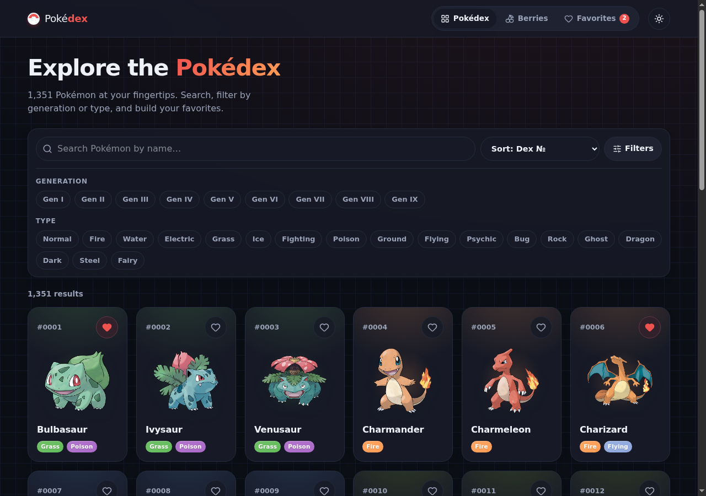
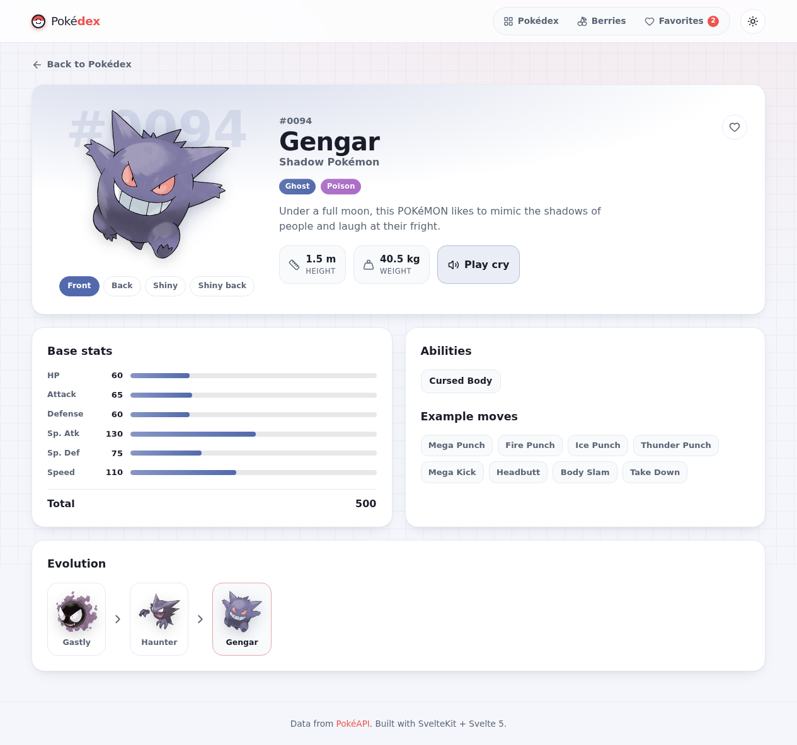

<div align="center">

# ⚡ Pokédex

### A fast, animated Pokédex for the modern web — powered by [PokéAPI](https://pokeapi.co).

**[🔴 Live demo → azagatti.github.io/pokedex-tw-opuslo-off-1](https://azagatti.github.io/pokedex-tw-opuslo-off-1/)**

[](https://github.com/AZagatti/pokedex-tw-opuslo-off-1/actions/workflows/ci.yml) [](https://azagatti.github.io/pokedex-tw-opuslo-off-1/)    

</div>

---

<div align="center">
  
  
  <br/>
  
</div>

---

## ✨ Features

- **🗂️ Infinite-scroll Pokédex** — a responsive card grid of all 1,300+ Pokémon, loaded 30 at a time via `IntersectionObserver` with shimmering skeleton loaders and type-colored gradient cards.
- **🔎 Search & filters** — debounced name search, filter by **generation (1–9)** and by **type (18 elements, multi-select)**, plus **sort** by dex number or base-stat total. Clear-filters control and a friendly empty state.
- **📇 Rich detail pages** — large official artwork with an animated entrance, **animated base-stat bars**, abilities (with a hidden-ability tag), example moves, the full **evolution chain**, a **front / back / shiny sprite switcher**, and a **play-cry** audio button.
- **🍒 Berries** — a companion index of every berry with detail pages showing firmness, flavors, growth time and size.
- **❤️ Favorites** — heart any Pokémon from a card or detail page; your collection persists in `localStorage` across reloads.
- **🌗 Dark / light theme** — a persisted theme toggle that also respects your system preference.
- **♿ Accessible & tasteful motion** — semantic markup, keyboard focus states, `aria` labels, alt text, and animations that fully honor `prefers-reduced-motion`.

## 🧰 Tech stack

| Concern | Choice |
| --- | --- |
| Framework | **SvelteKit** + **Svelte 5 runes**, TypeScript (strict) |
| Deployment | `@sveltejs/adapter-static` — SPA with a `404.html` fallback, static shells prerendered |
| Styling | **Tailwind CSS v4** for layout + hand-written CSS for motion |
| Icons | `lucide-svelte` |
| Data | native `fetch` in SvelteKit `load` functions + a tiny URL-keyed in-memory cache |
| Validation | **zod** — a schema per PokéAPI shape, parsed on every response |
| State | Svelte 5 runes + `localStorage`-backed stores for favorites & theme |
| Testing | **vitest** (unit + component) & **Playwright** (e2e) |
| Lint / format | **ultracite** → **oxlint** + **oxfmt** |
| Git hooks | **lefthook** (pre-commit: lint + format + typecheck; pre-push: unit tests) |
| CI/CD | GitHub Actions → lint → check → test → build → deploy to GitHub Pages |

## 🚀 Run locally

```bash
git clone https://github.com/AZagatti/pokedex-tw-opuslo-off-1.git
cd pokedex-tw-opuslo-off-1
npm install
npm run dev        # http://localhost:5173
```

Other scripts:

```bash
npm run build         # production static build → ./build
npm run preview       # serve the production build
npm run lint          # oxlint
npm run format        # oxfmt
npm run check         # svelte-check / tsc
npm run test:unit     # vitest (unit + component)
npm run test:e2e      # Playwright end-to-end
npm run test          # everything
```

## 🏗️ Architecture

A pure client-rendered SPA served as static files from GitHub Pages:

```
Route load()  ──▶  api/client.ts  ──▶  api/cache.ts (Map keyed by URL)  ──▶  fetch → zod.parse
     │                                        │
     ▼                                        └─▶ dedupes in-flight + memoizes parsed results
  +page.svelte (Svelte 5 runes) ──▶ components ──▶ UI
```

- **`src/lib/api`** — `schemas.ts` (zod), `cache.ts` (in-memory cache + `ApiError`), `client.ts` (typed PokéAPI fetchers).
- **`src/lib/stores`** — `favorites.svelte.ts` and `theme.svelte.ts` rune classes persisted to `localStorage`.
- **`src/lib/components`** — presentational Svelte components (cards, badges, stat bars, toolbar, evolution chain…).
- **`src/routes`** — `/` list, `/pokemon/[name]`, `/berries` + `/berries/[name]`, `/favorites`, plus `+error.svelte`.

See [`docs/ARCHITECTURE.md`](docs/ARCHITECTURE.md) for data-flow, caching and routing details, and [`docs/DECISIONS.md`](docs/DECISIONS.md) for why each pinned choice was made.

---

<div align="center">
<sub>Pokémon and all related media are trademarks of Nintendo. Data courtesy of <a href="https://pokeapi.co">PokéAPI</a>. Built as a portfolio piece.</sub>
</div>
